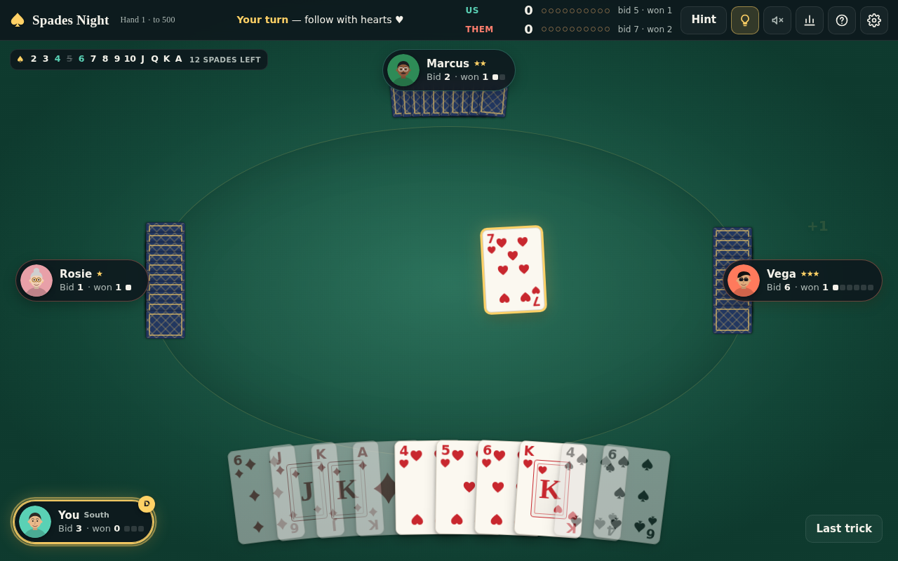
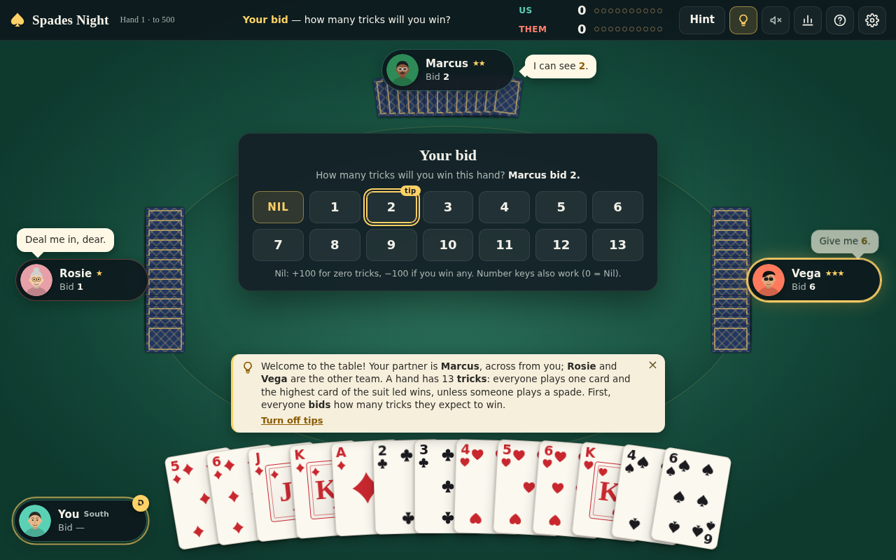
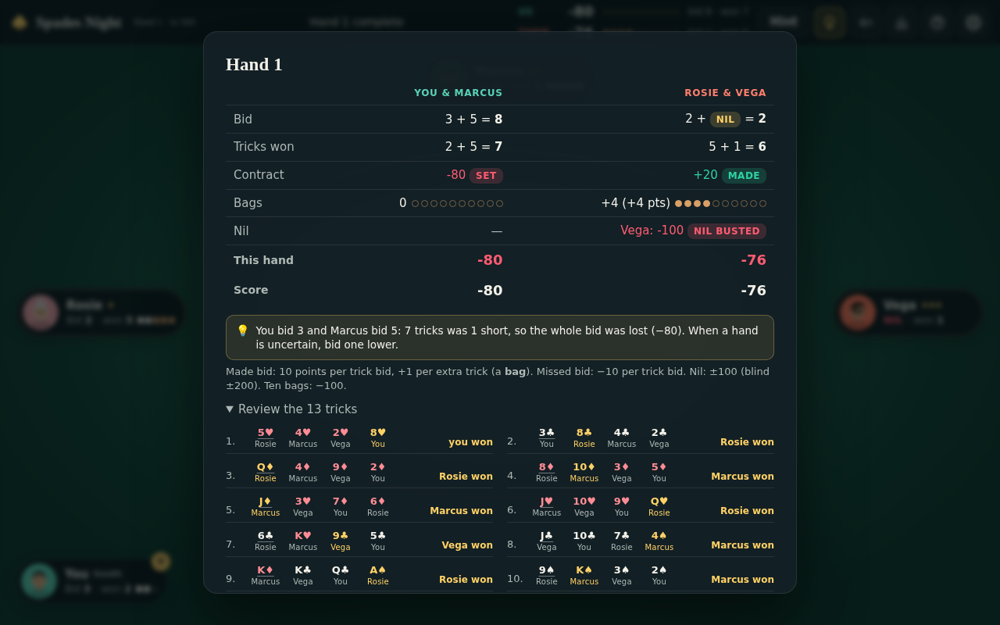

<p align="center">
  <a href="https://wilburfort.github.io/spades/">
    
  </a>
</p>

<h1 align="center">♠ Spades Night</h1>

<p align="center">
  <b>Partnership Spades in your browser, against three AI players who actually think.</b><br>
  A chatty rookie. A steady club player. A card-counting shark. And a coach that teaches, then gets out of the way.
</p>

<p align="center">
  <a href="https://wilburfort.github.io/spades/"></a>
  <a href="https://github.com/WilburFort/spades/actions/workflows/ci.yml"></a>
  
  
  <a href="LICENSE"></a>
</p>

<p align="center">
  <a href="https://wilburfort.github.io/spades/">Play</a> ·
  <a href="#run-it-yourself">Run it yourself</a> ·
  <a href="#meet-the-table">Meet the table</a> ·
  <a href="#how-the-bots-think">How the bots think</a> ·
  <a href="CONTRIBUTING.md">Contribute</a> ·
  <a href="docs/TODO.md">Roadmap</a>
</p>

---

## Why you'll like it

- **Opponents with real, different skill.** Not one bot with a difficulty slider. The rookies make the mistakes real beginners make (leading aces, trumping their own partner, bleeding bags). The solid players bid honestly and duck under a winning partner. The experts count every card, infer who's out of what, and simulate the rest of the hand hundreds of times before they play. Proven by simulation: solid beats rookie 100% of the time, expert beats solid 93%.
- **A partner who behaves.** Your teammate never trumps your winning card, always tries to rescue your Nil, and never bids Nil on top of yours. Partnership etiquette is hard-coded; rollout noise can't override it.
- **A coach that teaches, then leaves.** Short prompts at the moments that matter: your first bid, following suit, when spades break, when your partner is already winning, when the other team can be set. Each tip retires after a few showings. It suggests a bid, warns before a blunder, and offers a hint on demand. One click turns it off completely.
- **Looks like a real table.** Cards drawn in CSS and SVG with proper pips and face cards, glass nameplates with parametric avatars, a gold glow on the winning card, a trick sweep to the winner, stamps for **SET!** and **NIL BUSTED**, table talk in speech bubbles, and a hand summary that counts up like a receipt.
- **One file. No install. Works offline.** The entire game is a single HTML file with zero runtime dependencies. Download it, email it, put it on a USB stick; it plays anywhere.
- **Built for people, keyboard included.** Arrow keys walk your playable cards, number keys bid, every dialog traps focus, illegal cards are dimmed and explain themselves, and a refresh resumes exactly where you were. Every deal has a number, so a hand you loved (or a bug you found) can be replayed with `?seed=N`.

## Meet the table

| | Character | Skill | How they play |
|---|---|---|---|
| 🌸 | **Rosie** | ★ Rookie | Warm and chatty. Plays by feel, underbids, apologizes when she trumps her partner. |
| 🧢 | **Benny** | ★ Rookie | "I've got a good feeling about five!" Overbids, leads aces, loves to trump. |
| 📒 | **Marcus** | ★★ Solid | Tidy club player. Honest bids, hates bags, ducks once the contract is in. |
| 🎯 | **Dee** | ★★ Solid | Competitive league regular. Good instincts, a little chatty. |
| 🕶️ | **Vega** | ★★★ Expert | Card shark. Counts every spade, sets your bids, hands you bags "on the house." |
| 🎓 | **Prof. Okafor** | ★★★ Expert | Patient and precise. Generous with card-counting facts. |
| 🌑 | **Sable** | ★★★ Expert | Says almost nothing. Misses almost nothing. |

Three preset tables, or pick your own lineup:

| Table | Partner | Opponents | For |
|---|---|---|---|
| **Casual** | Marcus ★★ | Rosie ★ · Benny ★ | Learning the game with a safety net |
| **Standard** (default) | Marcus ★★ | Rosie ★ · Vega ★★★ | A mixed table: one soft spot, one shark. A competent player wins a little over half the time. |
| **Hard** | Prof. Okafor ★★★ | Vega ★★★ · Sable ★★★ | The pro table. Wins here are earned (about 40% for a strong player). |

## How the bots think

Every bot receives only what a human in that seat could know: its own hand plus the public table (`src/engine/view.js`). Cheating is structurally impossible.

- **Rookie**: counts aces and kings, plays its highest card to win (even over its partner), trumps whenever it can, tosses random cards when it can't win.
- **Solid**: protected-honour bidding, wins as cheaply as possible, ducks under a winning partner, covers a partner's Nil and squeezes an opponent's, stops taking tricks once the contract is safe.
- **Expert**: everything Solid knows, plus card counting and void inference, then **Monte Carlo rollouts**. For every decision it imagines the unseen cards dealt to the other seats (consistent with every void and every bid it has observed), plays each candidate card out with the Solid policy for all four players, and picks the card with the best expected team score. It bids the same way, weighing each candidate bid, Nil included, by rollout. Fixed rollout counts keep a seeded game reproducible.

Measured with `npm run sim` over 30-game series at production settings: the expert pair beats the solid pair 28 times out of 30, makes 88% of its contracts, averages 0.6 bags per hand, and lands 25 of 28 Nils.

## The coach

<p align="center">
  
</p>

Toggle it with the lightbulb button, the **C** key, the lobby switch, or the *Turn off tips* link inside any prompt. When it's on: a suggested bid with a **Why?** that names your actual cards, a second-tap warning before a blunder bid, rule explanations the first few times they matter, strategy nudges at most once per hand, a **Hint** (**H**) for the current trick, a spade tracker, and one line of feedback on each hand summary. Turn indication, the status line and the "you must follow suit" feedback are game UI and never turn off.

<p align="center">
  
</p>

## Rules and house rules

Standard partnership Spades. 13 cards each; spades are always trump; follow suit if you can; spades can't be led until broken (unless spades are all you have). Make your team's bid for **10 points per trick** plus 1 per overtrick (a **bag**); miss it for **−10 per trick**. **Nil** is ±100, **Blind Nil** ±200 (offered when you're 100+ behind). Ten bags cost 100. First team to 500 wins.

House rules in the lobby: target score (200 to 750), bag penalty on/off, blind nil, whether a busted Nil's tricks still help the partner, 10-for-200, and lose-at-−200.

## Keyboard

| Key | Does |
|---|---|
| **1–9**, **0** | Bid (0 is Nil; **1** then **0–3** for 10–13) |
| **← →** then **Enter** | Walk your playable cards and play the focused one |
| **H** | Hint for this trick |
| **C** | Coach tips on/off |
| **M** | Mute |
| **?** | Rules |
| **Esc** | Close a dialog |
| any click or key | Skip the pause after a trick |

## Run it yourself

**Just play:** open <https://wilburfort.github.io/spades/>, or grab `spades.html` from the [latest CI run](../../actions/workflows/ci.yml) and open it in any modern browser. No server, no install.

**Develop:**

```bash
git clone https://github.com/WilburFort/spades.git
cd spades
npm install        # dev tools only: esbuild (build) and playwright (tests)
npm start          # http://localhost:8080
```

```bash
npm test           # 44 unit tests: rules, scoring branches, AI legality, etiquette
npm run e2e        # 8 Playwright tests in real Chromium (first time: npx playwright install chromium)
npm run sim        # bot-vs-bot skill comparison
npm run build      # dist/spades.html, one self-contained file, zero network requests
```

Handy URL flags: `?seed=123` (replay a deal), `?fast=1`, `?autostart=1`, `?autoplay=1` (the human seat plays itself), `?coach=0`, `?talk=0`, `?sound=0`, `?preset=hard`, `?partner=dee&west=rosie&east=vega`, `?target=250`. Flags apply to that visit only. A debug API lives at `window.__spades` (`getState()`, `bid(n)`, `play('QS')`).

## Under the hood

Vanilla ES modules, no framework, no build step for development. About 6,000 lines including tests.

```
src/engine/   pure rules: cards, seeded RNG, dealing, bidding, trick play, scoring, per-seat views
src/ai/       the bots: analysis (card counting, voids), bidding, play policies, Monte Carlo, simulator
src/app/      controller (the async game loop), coach copy and triggers, roster, settings/persistence
src/ui/       table renderer and animations, dialogs, CSS/SVG cards, avatars, WebAudio sound
tests/        node --test suites (unit + end-to-end)
docs/         DESIGN.md (the spec), TODO.md (the roadmap), screenshots
```

## Contributing

Pull requests are very welcome, from a new character's one-liners to a smarter expert. Start with **[CONTRIBUTING.md](CONTRIBUTING.md)** for setup, a map of the code and good first issues, and **[docs/TODO.md](docs/TODO.md)** for what's open. Found a bug? [Open an issue](../../issues/new/choose) with the deal number and we can replay the exact hand.

## License

[MIT](LICENSE). Play it, fork it, ship it, teach with it.

<p align="center"><sub>Made with a seeded deck and a lot of imagined hands.</sub></p>
